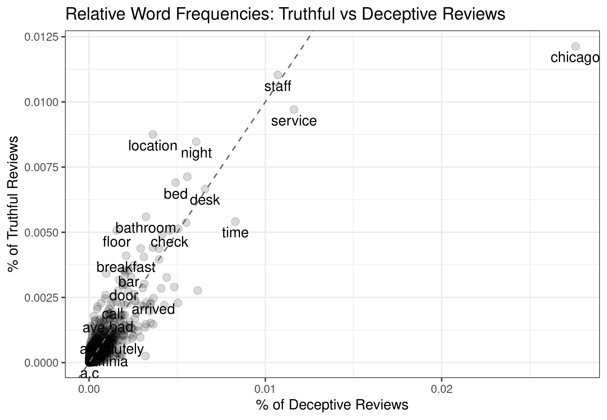

## Motivation

The last two weeks of Social Media and Web Analytics focused on regression and the notion of causal inference to understand and draw conclusions from data.
Now, we'll turn to another important aspect of social media and web data, *text*.

Over the last two decades there has been a shift from using text as something we "read" to digest and summarise to treating it as an input to a more automated processes for analysis.
This new methodology treats the text as data to be processed and analysed, and maybe we don't even "read" the raw text itself.
Given the sheer amount of text that is now available on the web and across social media - these methods which treat "text as data" have become widespread and an essential part of a marketing analyst's toolkit.
This tutorial aims to work through some introductory tools & methods available to us.

## Learning Goals

By the end of this tutorial you will be able to:

1. Transform text data to obey "tidy" data principles.
2. Summarize the length a set of texts.
3. Clean up text data by removing stop words, excess numbers, and lemmatize words.
4. Visualize differences in text across different pre-classified classes of text.
5. Use the insights from text analytics to answer questions that are managerially relevant and/or have marketing implications.

## Instructions to Students

These tutorials are **not graded**, but we encourage you to invest time and effort into working through them from start to finish.
Add your solutions to the `lab-04_answer.Rmd` file as you work through the exercises so that you have a record of the work you have done.

Obtain a copy of both the question and answer files using Git.
To clone a copy of this repository to your own PC, use the following command:


Once you have your copy, open the answer document in RStudio as an RStudio project and work through the questions.

The goal of the tutorials is to explore how to "do" the technical side of social media analytics.
Use this as an opportunity to push your limits and develop new skills.
When you are uncertain or do not know what to do next - ask questions of your peers and the instructors on the class Slack channel `#lab-04-discussion`.

\newpage

## Exercise 1: Text Analytics with Fake Reviews

This exercise works with data on hotel reviews. 
The reviews are a collection of truthful and deceptive (i.e. fake) reviews of 20 hotels in the Chicago area, known in the computational linguistics community as the Deceptive Opinion Spam dataset.^[
The data originally was published in the paper "Finding Deceptive Opinion Spam by Any Stretch of the Imagination" by M. Ott, Y. Choi, C. Cardie, and J.T. Hancock in 2011 in the Proceedings of the 49th Annual Meeting of the Association for Computational Linguistics: Human Language Technologies
]
Deceptive reviews are reviews that have been written by someone who has not stayed at the hotel they are reviewing.
The data contains 1600 reviews:

* 400 truthful, positive reviews from TripAdvisor
* 400 deceptive positive reviews from Mechanical Turk
* 400 truthful, negative reviews from Expedia, Hotels.com, Orbitz, Priceline, TripAdvisor, and Yelp
* 400 deceptive negative reviews from Mechanical Turk

The data is saved as part of this repository, stored in `data/reviews.csv`:

You might need to use the following `R` libraries throughout this exercise:^[
    If you haven't installed one or more of these packages, do so by entering `install.packages("PKG_NAME")` into the R console and pressing ENTER.
]

```{r, eval = TRUE, message=FALSE, warning=FALSE}
library(readr)
library(dplyr)
library(tibble)
library(tidyr)
library(stringr)
library(tidytext)
library(ggplot2)
library(magrittr)
library(textstem)
library(reshape2)
library(wordcloud)
```

1. Assuming online reviews are all truthful, explain whether they should benefit or harm consumers and the hotels themselves.

Write your answer here

2. If fake reviews are mixed in with truthful reviews on a website (for example, TripAdvisor) identify two reasons why their presence may harm consumers, hotels and the review website. 
Explain the mechanisms through which the harm is done.

Write your answer here

3. Load the data located in `data/reviews.csv` into a data frame called `hotel_reviews`.

```{r}
# Write your answer here
```


4. In what follows we will need each hotel review (i.e. each row of the data) to have a unique identifier. 
  Create a new column called `ID` in the dataset that has a unique identifier for each review.

HINT: the function `row_to_column()` function will help you do this.

```{r}
# Write your answer here
```


5. Convert the dataset to conform with tidy data principles:
  * Each variable is a column
  * Each observation is a row
  * Every cell is a single value

Name the resulting dataset `tidy_reviews`.
  
```{r}
# Write your answer here
```


6. Create a dataset called `review_length` that has two columns, a column that identifies the review and a column that counts the number of words in the review.
Merge the the `review_length` data into the `hotels_df` dataset.

```{r}
# Write your answer here
```


7. Are deceptive reviews longer than truthful reviews?
   If you presented this result to a marketing manager that has little analytics training what do you expect they would say about the possibility of detecting deceptive reviews?
   Would you agree or disagree? 

```{r}
# Write your answer here
```

   
8. What are stop words? 
Explain why you would want to remove them from the review text.

Write your answer here
   
9. Remove stop words from each review using a default stop word list. Name the dataset with no stop words `tidy_reviews_no_stop`.
   What are the 20 most common words in the dataset?

```{r}
# Write your answer here
```


10. Create a custom stop word list that contains words you might want to remove in addition to the default stop word list. 
Remove these words from `tidy_reviews_no_stop`.

```{r}
# Write your answer here
```


11. Also remove any numbers from `tidy_reviews_no_stop`.

The following code can be used to get started:

```{r, eval = FALSE}
# First, find all numbers:
nums <- YOUR_CODE %>%
  # find all numbers in the data
  filter(str_detect(word, "^[0-9]")) %>%
  YOUR_CODE

# now remove those:
tidy_reviews_no_stop <- YOUR_CODE
```


```{r}
# Write your answer here
```


The next step we want to perform is to lemmatize each word.
The goal of lemmatizing is to reduce inflectional forms and some common derivationally related forms of a word to a base word.
For example: 

* am, are, is $\Rightarrow$ be
* car, cars, car's, cars' $\Rightarrow$ car

To lemmatize each word in the reviews we will use the `lemmatize_words()` from the `textstem package`:^[
    An alternative would be to "stem" each word, which essentially chops off the ends of words in the hope of achieving this goal correctly most of the time, and often includes the removal of derivational affixes.
]

```{r}
# Write your answer here
```


12. Create a plot that graphs the frequency a word is used in deceptive reviews on the x-axis against the frequency the same word is used on the y-axis.
To help you in coding up this plot, your final result should look like the following:^[
Depending on your custom stopword list in (10) you might see slight differences between your figure and this one.
]

```{r, echo = FALSE, eval = TRUE, fig.align="center", out.width="75%"}

```

  Perform the following steps:
  
  (a) Create a dataset called `wrd_frequency` that has three columns: a column `word` that contains all the unique words, a column `deceptive` that has the percentage of deceptive reviews that each word is included in and a column `truthful` that has the percentage of truthful reviews that each word is included in.
  (b) Create the plot described above. 
      Include a 45 degree line for reference.

To assist you in creating the plot, use the following starter code:

```{r, eval = FALSE}
# part (a)
wrd_frequency <- tidy_reviews_lemma %>%
  count(YOUR_CODE) %>%
  group_by(YOUR_CODE) %>%
  mutate(YOUR_CODE) %>% 
  spread(YOUR_CODE)

# part (b)
wrd_frequency %>%
  ggplot(aes(x = YOUR_CODE, 
             y = YOUR_CODE, 
             label = YOUR_CODE 
           )) +
  geom_YOURCODE(alpha = 0.15, 
                size = 2.5
              ) +
  geom_text(aes(label = YOUR_CODE), 
            check_overlap = TRUE, 
            vjust = 1.5
            ) +
  geom_abline(YOUR_CODE,
              lty = 2, 
              color = "grey40"
              ) +
  YOUR_CODE
```


```{r}
# Write your answer here
```


An alternative way to visualize the differences and commonalities in word use between truthful and deceptive reviews is to construct word clouds.
To assist you in creating the plots, use the following starter code for each of the next two questions:

```{r, eval=FALSE}
tidy_reviews_lemma %>%
  count(YOUR_CODE, 
        YOUR_CODE, 
        sort = TRUE
        ) %>%
  acast(YOUR_CODE ~ YOUR_CODE, 
        value.var = "n", 
        fill = 0
        ) %>%
  YOUR_CODE
```

      
13. Create a word cloud that visualizes the differences in word use between deceptive and truthful reviews. 
Use a maximum of 75 words in the word cloud.

```{r}
# Write your answer here
```


14. Create a word cloud that visualizes the commonalities in word use between deceptive and truthful reviews. 
Use a maximum of 75 words in the word cloud.

```{r}
# Write your answer here
```


15. Provide a brief summary of what you learn from the three plots. (Max. 10 sentences)

Write your answer here

16. In their 2014 AER article, Mayzlin, Dover and Chevalier argue that fake/deceptive reviews are difficult to detect.^[
  Mayzlin, Dina, Yaniv Dover, and Judith Chevalier. 2014. "Promotional Reviews: An Empirical Investigation of Online Review Manipulation." American Economic Review, 104 (8): 2421-55.
] 
Based on your analysis, do you agree with their presumption? Explain the marketing implications of your conclusions. (max. 10 sentences)

Write your answer here

17. (Harder!) Suppose you were working in an analytics team that wanted to build a predictive model to detect fake reviews on a platform such as TripAdvisor.

(a) Can you sketch out a method/model to predict whether a review is fake? Your method should be scaleable so that it can handle thousands of new reviews per day.
You can use any combination of words, figures, simple equations or pseudocode to explain your thoughts.

Write your answer here

(b) How could you assess how successful the model is at detecting fake reviews?

Write your answer here

(c) Suppose the model was adopted by the platform.
If you detected a newly posted review was fake, would you want to remove it from the platform? 
Or would you leave the review online with a notification that this review might be fake? 
Explain.

Write your answer here

